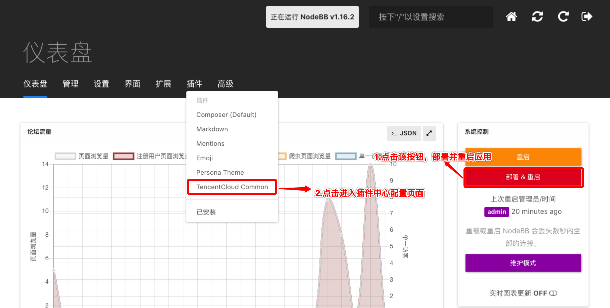
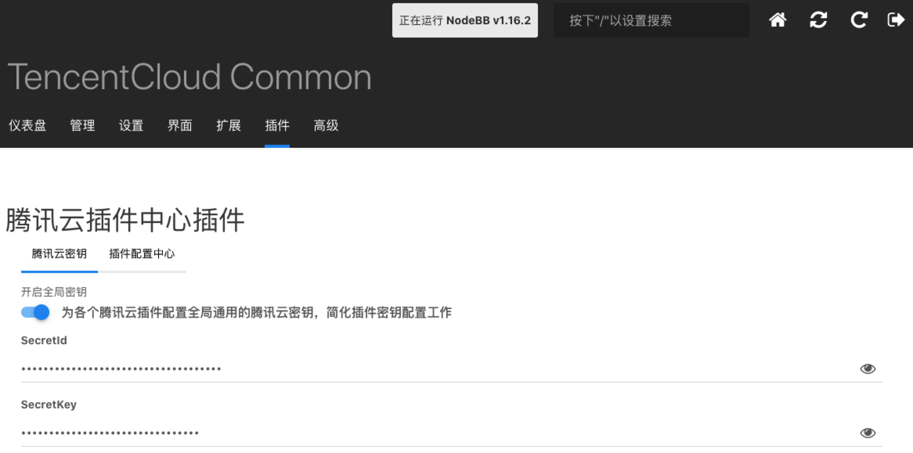
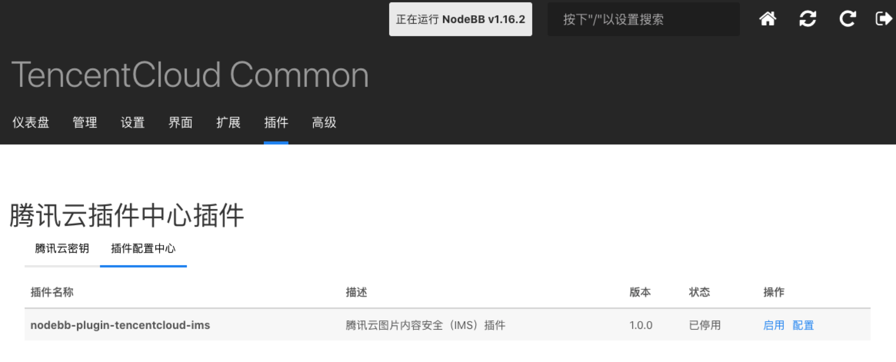

# 腾讯云插件中心插件

## 0.版本依赖

- NodeBB 1.16.2+

## 1. 插件介绍
| 标题      | 名称    |
| ----     | ---------------- |
| 中文名称   | 腾讯云插件中心插件 |
| 英文名称   | nodebb-plugin-tencentcloud-common |
| 最新版本   | v1.0.0 (2021.03.16) |
| 适用平台   | [NodeBB](https://nodebb.org) |
| GitHub项目| [tencentcloud-nodebb-plugin-common](https://github.com/Tencent-Cloud-Plugins/tencentcloud-nodebb-plugin-common) |
| gitee项目| [tencentcloud-nodebb-plugin-common](https://gitee.com/Tencent-Cloud-Plugins/tencentcloud-nodebb-plugin-common) |
| 主创团队   | 腾讯云中小企业产品中心（SMB Product Center of Tencent Cloud） |

NodeBB腾讯云插件中心插件是集合所有腾讯云插件的公共管理模块，方便插件使用者统一管理腾讯云插件和配置腾讯云密钥，**其他NodeBB腾讯云插件依赖于该插件，所以请先安装并激活该插件**。

## 2.功能特性

- 集中显示管理NodeBB腾讯云插件
- 配置全局腾讯云密钥信息

## 3.安装指引

### 3.1.部署方式一：通过NodeBB站点后台安装
> 1. 你的NodeBB站点后台=》插件=》已安装 =》寻找插件。在页面搜索框输入nodebb-plugin-tencentcloud-common
> 2. 点击"安装"按钮，就会自动下载安装插件
> 3. 启用该插件

### 3.2.部署方式二：通过npm安装
> 1. 在你的NodeBB项目根目录执行npm install nodebb-plugin-tencentcloud-common
> 2. 重启Nodebb应用
> 3. 启用插件

## 4.使用指引
### 4.1.使用介绍
安装并启用该插件后，在NodeBB站点后台部署并重启应用，然后进入插件中心配置页去配置插件

### 4.2.界面功能介绍

> 上图为全局的腾讯云密钥配置界面，此处配置的密钥信息可供所有腾讯云插件共享。

> 上图页面为NodeBB腾讯云插件中心的管理界面，能显示站点中全部的腾讯云插件并能控制各个插件的启用状态，且可以单独配置插件的腾讯云密钥等。

### 4.3.名词解释
- **SecretId**：在腾讯云云平台API密钥上申请的标识身份的 SecretId。详情参考[腾讯云文档](https://cloud.tencent.com/document/product)
- **SecretKey**：在腾讯云云平台API密钥上申请的标识身份的SecretId对应的SecretKey。详情参考[腾讯云文档](https://cloud.tencent.com/document/product)

## 5.获取入口

| 插件入口          | 链接                                                         |
| ----------------- | ------------------------------------------------------------ |
| Github | [腾讯云插件中心插件](https://github.com/Tencent-Cloud-Plugins/tencentcloud-nodebb-plugin-common) |
| Gitee | [腾讯云插件中心插件](https://gitee.com/Tencent-Cloud-Plugins/tencentcloud-nodebb-plugin-common) |

## 6.FAQ

> 暂无

## 7.版本迭代记录

### 7.1 nodebb-plugin-tencentcloud-common v1.0.0
- 集中显示管理NodeBB腾讯云插件
- 配置全局腾讯云密钥信息

## 8. 联系我们

如果您是用户，欢迎加入我们的[官方交流社区](https://dnspod.chat/category/10)，反馈
- bug和故障，获取帮助。
- 新的插件功能需求。
- 新的开源应用插件适配需求。

如果您是开发者，欢迎参与我们[插件开源项目](https://github.com/Tencent-Cloud-Plugins)，和我们一起修复插件问题，为更多开源应用适配腾讯云插件。